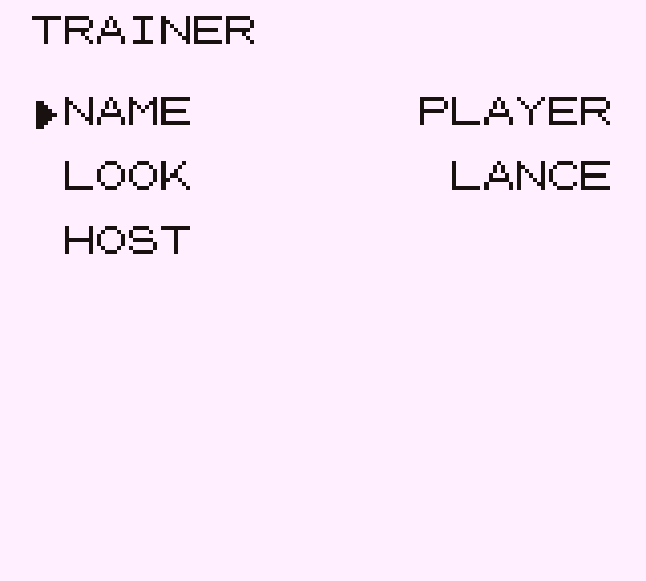
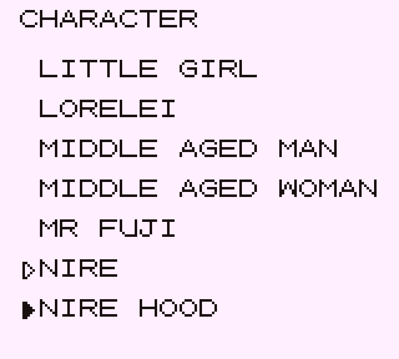
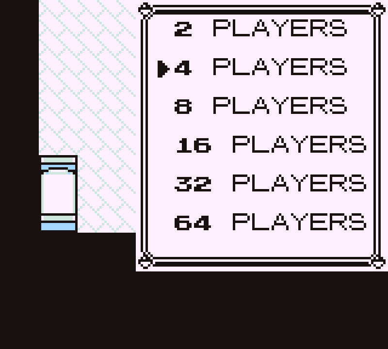
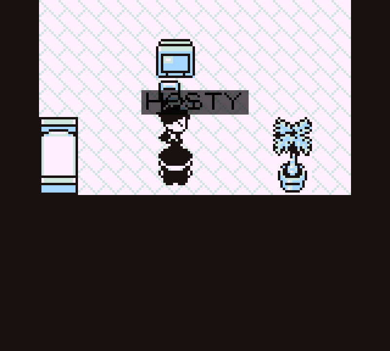
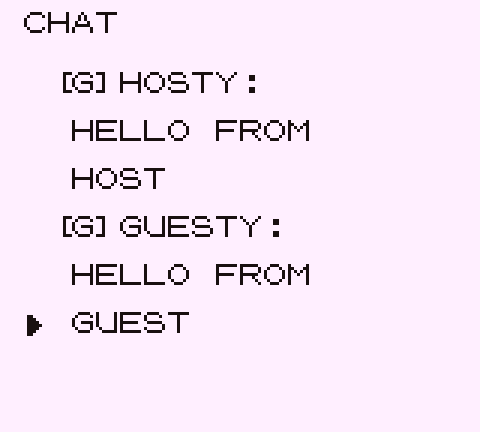
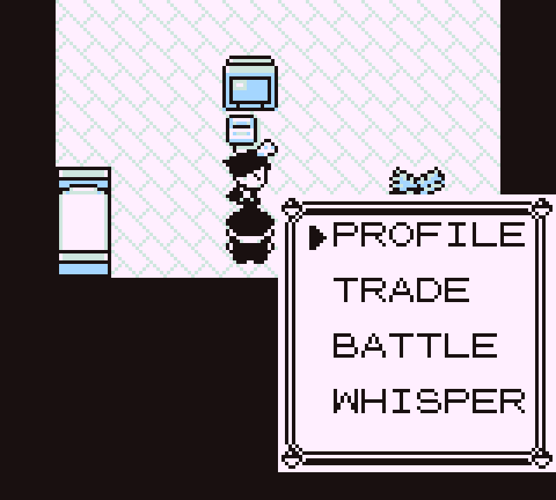
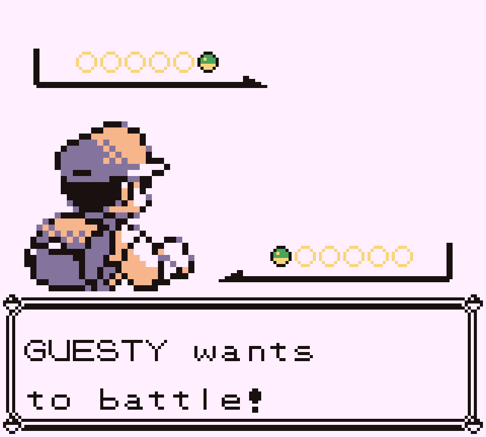
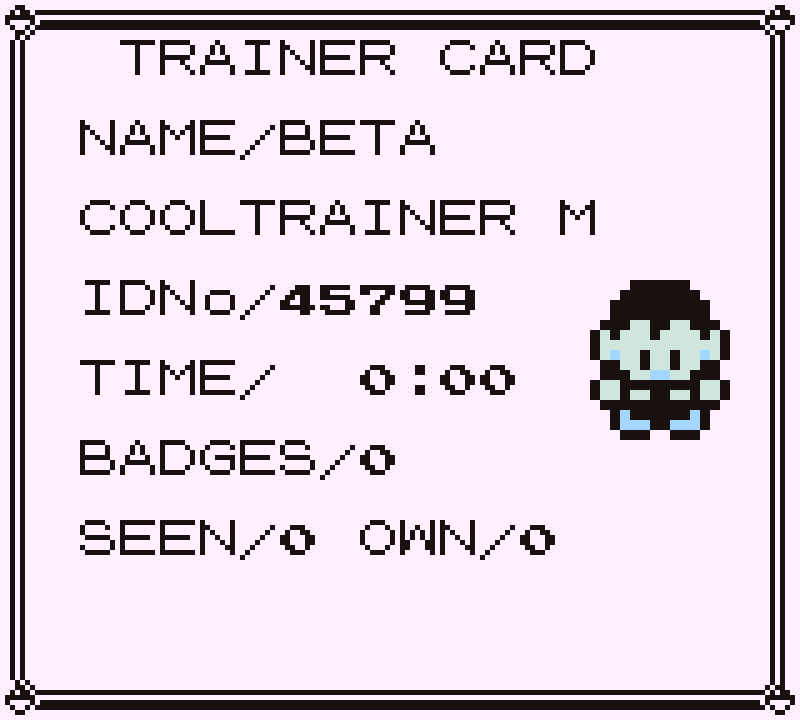
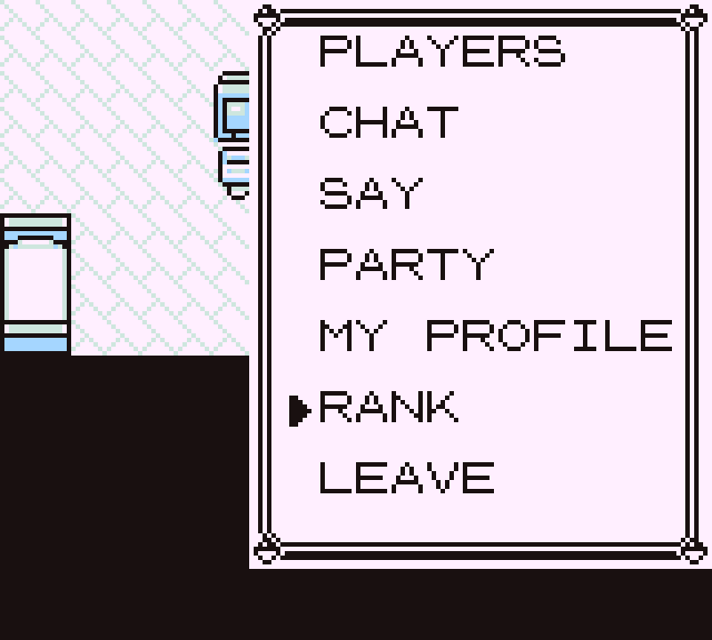

# RBY MMO

### Kanto, but your friends are in it.

Other trainers walk the same routes you do — real sprites, names over their
heads, chat bubbles when they talk. Bump into someone outside Viridian and
trade on the spot. Or throw down, right there on the grass.

A multiplayer mod for [Gen1Recomp](https://github.com/bryanthaboi/gen1recomp).


**No server to rent. No accounts. No signup.** One of you hosts from inside
the game — you're a player, your copy is just also the relay.

---

## 🎮 Get in

**1. Install it.** Grab `rby_mmo-<version>.zip` from
[Releases](https://github.com/alamops/RBYMMOMod/releases), then in the game:
**MODS → Import mod .zip**. That's the whole install — the archive carries
`manifest.json` at its root, which is the shape the importer expects, so it
also unzips into your `mods/` folder by hand if you'd rather.

Every release ships a `sha256sums.txt` beside the zip if you want to check
what you downloaded.

**2. Turn it on.** Launch the game, press **F10**, enable **RBY MMO**, and
let it restart when it asks. It ships flagged `experimental`, so it stays off
until you say otherwise — installing it is never what opens a socket.

**3. One of you hosts.** `START → MMO → HOST GAME`.

Character creation comes first: pick a **NAME** (your save file keeps its
own) and a **LOOK** from the 36 walking characters in the game. Confirm, pick
a room size, and you're live.

The HOST screen mints a **six-character passcode** on the way in and shows it
in the `JOIN CODE` row — `A7K3P9`, letters and digits, no dashes. There's
nothing to type and no way to host without one: every game has a door on it.
Change it from that row if you'd rather pick your own.

<p align="center">
  
  
  
</p>

The menu's **ADDRESS** row then shows something like `192.168.1.125:7788`
with `CODE: A7K3P9` on the line under it — they're read out in the same
breath, so they're shown in the same box.

**4. Everyone else joins.** `START → MMO → JOIN GAME`, make their own
trainer, then **the address and the passcode**, in that order, before
anything is dialled. (**SELECT** flips the keyboard to digits — the vanilla
one has none.)

An IP or a hostname both work — `192.168.1.125:7788` or
`MYBOX.EXAMPLE.COM:7788` — and leaving the port off fills in **7788**. Case
doesn't matter for a hostname; DNS doesn't care either. Dashes, spaces and
lower case in a passcode are normalised away, so one copied out of a chat
message works as typed.

**Staying current.** The manifest points at this repo, so the launcher's
mod list checks Releases for you and offers the newer build under **Other
versions** — you don't have to come back here to find out something shipped.
It only ever asks; nothing updates itself behind you.

Everyone on the same Wi-Fi or LAN can join straight away — no configuration,
just the address and the passcode. Across the internet the host has to
forward port **7788** — or nobody forwards anything and you all join a
standalone hub on a box that already has a public address instead
([server/README.md](server/README.md)).

---

## ⚡ Features

```
╔════════════════════════════════════════════════════════════╗
║  SHARED KANTO      up to 64 trainers, one live overworld   ║
║  ZERO SETUP        one of you hosts from inside the game   ║
║  FULL LINK SUITE   trade + battle, anywhere on the map     ║
╚════════════════════════════════════════════════════════════╝
```

### 👥 THEY'RE REALLY THERE
Every other player on your map is a **genuine overworld NPC** — right sprite,
right depth sorting, right palette — walking tile to tile on the engine's own
16-frame step clock. Not a sprite bolted on top. Nameplates ride over their
heads; chat bubbles pop when they talk.

<p align="center">
  
  
</p>

### 💬 TALK TRASH ON A GAME BOY KEYBOARD
Three scopes, composed on the vanilla naming grid:

| Scope | Who hears it | Floats over your head |
| --- | --- | --- |
| `EVERYONE` | the whole hub | ✅ |
| `NEARBY` | same map, 12 tiles | ✅ |
| `WHISPER` | one player | ❌ — it's a whisper |

Unread messages flag the menu with `CHAT*`. And because the vanilla grid has
**no digits at all**, this mod adds a number page to its own screens —
**SELECT** flips `ABC` ⇄ `123`.

### 🔁 TRADE — ANYWHERE
No Cable Club. No Pokémon Center. Walk up, press **A**, pick `TRADE`. It runs
the engine's *own* `TradeSession`, untouched — so your Kadabra still evolves,
and the mon still gets stamped as traded with the original OT.

### ⚔️ BATTLE — ANYWHERE
Same deal, on the grass where you're standing. The real lockstep simulation a
link cable runs, carried over the wire. **Zero desyncs** across the full
end-to-end suite.

<p align="center">
  
  
</p>

### 🏠 YOU ARE THE SERVER
`HOST GAME`, pick a room size (**2–64**), done. You're a normal player who
happens to be the relay — you walk, chat, trade and fight like everyone else.
Want a box that stays up 24/7 instead? There's a standalone hub, same
protocol, and joiners can't tell the difference.

### 🔑 EVERY GAME HAS A DOOR ON IT
**A six-character passcode is required, both ways.** Hosting from the game
mints one and shows it on the HOST screen; the standalone hub refuses to
start without one. There is no open-world setting on either side. Six
characters (`A7K3P9`) from an alphabet with `I L O U` left out, so nothing is
misread off a screenshot or misheard over voice, and every character is on
the mod's own naming grid.

Where the standalone hub goes further is everything *around* the passcode: it
mints codes from a real CSPRNG, throttles wrong ones per address *and*
hub-wide, and adds per-address connection limits, bans, an allowlist, a
`doctor` that tells you who can actually reach your machine, and a hub that
stays up when you're not playing. Configure the lot from one command —
`docker compose up`, or `node server/bin/rby-mmo-hub.js init`.

**Six characters is 30 bits, and that is not much.** It keeps strangers out;
it does not survive somebody who can capture your traffic, because none of
this is encrypted. [server/README.md](server/README.md) does the arithmetic
in full and does not soften it.

### 🚪 DROP OUT, KEEP PLAYING
`LEAVE` disconnects and hands you straight back to single-player. Save,
world, party — untouched. No "returning to title screen".

### 🎭 BE SOMEBODY ELSE
Before you host or join, character creation asks who you are: a name of your
own (your save file keeps its own), and **any walking character in the
game** — 36 of them. Be Lance. Be Giovanni. Be a Rocket grunt, a Biker, a
Swimmer, Oak. You see it too, not just everyone else — and it's put back the
moment you leave.

If someone picks a character your ROM doesn't have, they show up as RED on
your screen rather than not at all.

### 🪪 CHECK THEIR CARD
Walk up, press **A**, and **PROFILE** sits at the top of the menu — their
trainer card, laid out like your own:

<p align="center">
  
</p>

Their portrait, who they are, who they're dressed as, trainer ID, hours
played, badges earned, and how much of the dex they've seen and caught. Not
their money — that's nobody else's business, so it isn't shown and isn't
sent.

### 🧩 STACKS WITH OTHER MODS
Spawning real NPCs means whoever owns the world pass draws your friends too.
Run it with a voxel renderer and they show up **as voxel characters**, no
work required.

---

## 🕹️ The menu

`START → MMO` is a bordered box in the corner like any other START submenu.
B goes back. The cursor remembers where you left it. The world stays visible
behind it.

<p align="center">
  
</p>

| Row | Shows up when | What it does |
| --- | --- | --- |
| `ADDRESS` | hosting | your address again — for when someone asks *again* |
| `PLAYERS` | connected | who's on, `n/limit` if you're hosting |
| `CHAT` / `SAY` | connected | the log (`CHAT*` = unread) and sending |
| `LEAVE` | you joined | drop out and **keep playing single-player** |
| `END GAME` | hosting | asks first — this one ends it for everybody |

Leaving isn't quitting. Your save, your world, your party: untouched. The
game just carries on without the other people in it.

Pressing **A** at another trainer opens a second, smaller box —
`PROFILE` / `TRADE` / `BATTLE` / `WHISPER` — about that player.

---

## ⚙️ Options

`MMO` in the mod manager (`F10`):

| Option | Default | Does |
| --- | --- | --- |
| `MAX PLAYERS` | 4 | room size for games you host (2–64, you count) |
| `JOIN` | `127.0.0.1:7788` | where JOIN GAME starts from |
| `JOIN CODE` | *(empty)* | the passcode used for a hub you haven't typed one for |
| `MY SPRITE` | RED | how everyone else sees you |
| `BUBBLES` | on | names and chat over heads |

These are just the *defaults* — HOST GAME asks the room size every time and
JOIN GAME lets you type an address and a passcode, and those in-game choices
stick with your save. (Mods can read their options but not write them, so the
in-game values live in the save file instead of overwriting the rows above.)

A passcode typed for a particular hub is stored **against that hub's
address**, so playing on two of them means typing neither twice. The `JOIN
CODE` row above is the fallback for a player who only ever plays on one.

Typing an address uses the number page described above — **SELECT** flips
`ABC` ⇄ `123`. Every other naming screen in the game is left untouched.

---

## 🧩 Plays nice with other mods

Tested against
[DramaticShapeVoxelMod](https://github.com/DramaticShape/DramaticShapeVoxelMod):
both load clean, and everything — presence, chat, trade, battle — works with
the voxel diorama running.

Your friends show up as **voxel characters**, free of charge. That's the
payoff for spawning real NPCs instead of drawing avatars: whoever owns the
world pass draws them too.

Nameplates are the one thing that can't follow into 3D — they're positioned
by tile offset, which only means anything in the flat projection. So when
another mod owns the world, the overlay names nearby players in a corner list
instead. You lose the arrows, nothing else.

It's entirely optional, and that's a *checked* claim — the test suite runs
both ways and pins which:

```sh
MMO_WITHOUT_MODS="DRAMATIC_SHAPE" bash mods/rby_mmo/tests/drivers/run-mmo-e2e.sh
MMO_WITH_MODS="DRAMATIC_SHAPE"    bash mods/rby_mmo/tests/drivers/run-mmo-e2e.sh
```

---

## 🔬 Prove it

> Everything below is for working *on* the mod, not for playing it. Players
> need none of it — install, enable, host. The scripts here assume a
> Gen1Recomp source checkout with this folder linked in at `mods/rby_mmo`.

**Running it from source.** Copy `.env.example` to `.env`, point `ROM_PATH`
at your own ROM, and:

```sh
bash mods/rby_mmo/tools/play.sh          # boots past the ROM screen, mod on
bash mods/rby_mmo/tools/play.sh guest    # a second window, separate save
```

Two windows on one machine is the quickest way to exercise host↔join while
developing — host in the first, then join `127.0.0.1:7788` from the second
with the passcode the HOST screen is showing. It is not how anyone should
actually play; that's the LAN flow above.

**The suites.**

```sh
luajit mods/rby_mmo/tests/rby_mmo_test.lua   # from the engine root
node server/hub.test.js                      # from this folder
```

The first drives the real headless loader — same `Loader`, same merge the
game uses — and hammers the protocol logic with fake peers. The second boots
the Node hub as a child process and drives it over real sockets.

But neither of those ever binds a socket, renders a menu, or spawns an
avatar. **This does:**

```sh
bash mods/rby_mmo/tests/drivers/run-mmo-e2e.sh
```

Two real LÖVE instances. Separate saves. A real socket between them. One
hosts, one joins, and both sides assert:

- ✅ the listener comes up and publishes an address you can re-read later
- ✅ each player lands on the other's roster
- ✅ avatars **walk** to where the network says they are — not teleport
- ✅ leaving a map despawns the avatar but keeps the player listed
- ✅ chat crosses both ways
- ✅ pressing A on someone opens TRADE / BATTLE
- 🔁 **a trade completes** — each side ends holding the other's Pokémon
- ⚔️ **a link battle runs to a decision**, zero `link.desync` on either side
- ✅ a guest LEAVEs and keeps playing

Screenshots land in `/tmp/rby_mmo_shots` so you can see it, not just read a
pass count.

> Two windows open and drive themselves. Don't click into them — you'll
> steal the input the drivers are queueing.

---

## 📦 Cutting a release

Pushing to `main` builds the installable zip and publishes it. There is no
manual step and no local build — the artifact players download is always one
GitHub Actions run away from a commit, so it can't quietly drift from the
source.

**To ship a version:** bump `version` in `manifest.json`, add the matching
`CHANGELOG.md` heading, push. The workflow takes the manifest's version when
it's ahead of every existing tag, which makes bumping the manifest the normal
way to cut a release. Failing that it falls back, in order, to a
`workflow_dispatch` input, a `[release X.Y.Z]` tag in the commit message, or
a patch bump on the newest `vX.Y.Z`. Whichever wins is written into the
manifest *inside the archive*, so an installed copy never reports a version
the release it came from doesn't have. An existing tag or release is refused
rather than overwritten.

Each run publishes `rby_mmo-<version>.zip` plus `sha256sums.txt`. The
filename matters: the launcher's update check looks for `<id>-<version>.zip`
first, and `manifest.json` sits at the archive root because that is one of
the two layouts **Import mod .zip** accepts.

**What the archive contains** is decided by `.modkitignore` — the release job
reads that same file rather than keeping a second list that could disagree
with it, so what a release hands a player is what `modkit pack` produces.
Tests, drivers, dev tooling and `docs/` stay out. `docs/` in particular holds
screenshots of a running game, which are composited from tiles, sprites and
font glyphs decoded out of the player's own ROM — fine on a page nobody
installs, not something to put in an archive that gets handed around.

---

## 🧑‍💻 Hooking in from your own mod

```lua
local mmo = mod.find("rby_mmo")
if mmo and mmo.exports.isConnected() then
  -- isHosting() tells you whether this copy is also the relay
  for _, player in ipairs(mmo.exports.players()) do
    print(player.name, player.map, player.x, player.y)
  end
  mmo.exports.say("global", "hello from my mod")
end
```

---

## 🚧 Known jank — read this bit

It's `0.2.0` and it ships flagged `experimental` on purpose. The full list
lives in `mod.card` under `differences.known`. The ones that'll actually bite
you:

- **No NAT traversal.** Hosting from the game means your friends have to
  reach *you*. LAN is effortless; over the internet somebody forwards 7788,
  or you all use a standalone hub on a box with a public address.
- **No host migration.** Host leaves → the game ends for everyone. They get
  told, rather than left staring at a frozen world.
- **Nameplates sit about a tile low.** You can see it in the shots above —
  the plate lands across the character's chest rather than over their head.
  This was previously written up here as drift at the edge of small maps,
  where the camera stops scrolling; that explanation doesn't survive a look
  at the engine's `Camera:follow`, which does no clamping at all. So the
  offset is real and reproducible, and the cause is still open.
- **Only ever tested over loopback**, two instances on one desk. Real latency
  and packet loss are still an unknown.
- **No accounts, and no encryption anywhere.** A passcode is required both
  ways, so nobody walks in off the port — but there's no identity beyond
  "holds a working passcode", and two friends can be online under the same
  name. More to the point, the traffic is **not encrypted**: anyone on the
  path can read it, and anyone who captures one handshake can grind the
  six-character passcode offline in seconds, where no rate limit reaches
  them. Host for people you know, or put everyone on WireGuard/Tailscale —
  see the security posture in [server/README.md](server/README.md), which
  spells out exactly what 30 bits buys.

---

## Licence

MIT, matching the engine. Bring your own ROM — this repo ships no game data
and never will.
